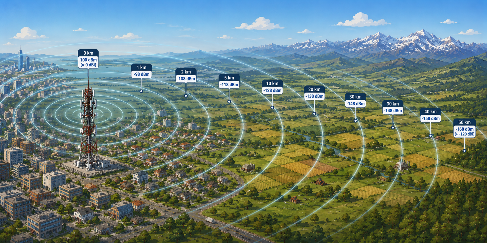

	

Escolher conectividade em IoT vai muito além de definir "qual rede usar". Em projetos reais, essa decisão afeta viabilidade financeira, velocidade de implantação, confiabilidade da operação e experiência do cliente no dia a dia.

Esta série foi criada para organizar esse tema de forma progressiva, conectando visão de negócio e fundamentos técnicos sem perder foco prático. A ideia é ajudar times de produto, engenharia e operações a tomarem decisões melhores antes que os problemas apareçam em campo.

Ao longo de 4 partes, vamos cobrir:

1. Fundamentos para decisões de conectividade em cenários reais de operação.
2. Rede celular para IoT e APN: funcionamento, modelos e critérios de escolha.
3. Redes não-celulares e padrões: Mesh, LoRa, LoRaWAN e Zigbee na prática.
4. Conectividade para dispositivos móveis em veículos, com foco em resiliência operacional.

## O que muda quando o dispositivo vai para a rua

Em laboratório, quase toda conectividade parece funcionar. Em produção, surgem as variáveis difíceis:

- Cobertura irregular em rodovias, subsolos, pátios industriais e áreas rurais.
- Congestionamento em horários de pico e eventos de massa.
- Troca de operadora por geografia, custo ou qualidade de sinal.
- Dependência de roaming nacional e internacional.
- Restrições de energia para equipamentos a bateria.

Essas zonas de baixa disponibilidade ou baixa qualidade de sinal são as chamadas áreas de sombra. Na prática, elas não são apenas pontos sem sinal: podem ser regiões com latência imprevisível, perda de pacotes ou oscilação de tecnologia (4G para 3G, por exemplo).

Fonte: [Wikimedia Commons - File:CellTowerRichmondHill.jpg](https://commons.wikimedia.org/wiki/File:CellTowerRichmondHill.jpg)

## Os três pilares da decisão de conectividade

Uma boa arquitetura IoT costuma equilibrar três eixos:

- Cobertura efetiva: não é só o mapa da operadora, é o desempenho no local de operação.
- Custo total: módulo, chip, dados, operação, suporte e retrabalho de campo.
- Confiabilidade operacional: capacidade de transmitir quando importa, mesmo em ambiente hostil.

Se um desses pilares falha, o projeto paga a conta depois em tickets, manutenção e perda de confiança do cliente.

## Tecnologias de forma simples

Antes de aprofundar a parte técnica, vale um resumo de alto nível:

- Celular (2G/3G/4G/5G, NB-IoT, LTE-M): cobertura ampla, boa para ativos móveis e cenários distribuídos.
- Banda larga fixa (fibra/cabo/rádio): ótima capacidade onde há infraestrutura local estável.
- Redes de baixa potência e longo alcance (LoRa/LoRaWAN): ideais para telemetria leve, grande autonomia energética e longas distâncias.
- Redes de curto alcance e baixa potência (Zigbee, Bluetooth Mesh): fortes em ambientes locais com muitos nós próximos.

Não existe tecnologia universalmente melhor. Existe a tecnologia adequada para o perfil de tráfego, mobilidade, energia e criticidade de cada caso.

## Onde o técnico encontra o comercial

Do lado comercial, a conectividade entra em quatro perguntas:

1. Qual o custo mensal por ativo e como ele evolui com escala?
2. Qual o risco de indisponibilidade em regiões críticas da operação?
3. Qual o impacto de falha de comunicação no negócio do cliente?
4. Qual o modelo de suporte quando houver perda de conectividade em campo?

Do lado técnico, as respostas passam por escolha de rede, fallback, buffering local, políticas de retransmissão e observabilidade.

## Estratégias para reduzir impacto de áreas de sombra

Mesmo antes de escolher protocolos detalhados, já é possível desenhar resiliência:

- Store-and-forward: o dispositivo guarda dados localmente e retransmite quando o link retorna.
- Dual-SIM ou multi-operadora: aumenta chance de cobertura em campo.
- Telemetria adaptativa: reduz taxa de envio quando a qualidade de link cai.
- Alertas de saúde de conectividade: mede perda, latência e reconexões por dispositivo.
- Priorização de payload: envia primeiro o que é crítico para operação.

## Normas e governança: por que importam

Projetos IoT maduros alinham tecnologia com normas e diretrizes de mercado:

- 3GPP para padrões de redes móveis.
- GSMA para práticas de ecossistema móvel e SIM.
- Regulamentação local (como Anatel no Brasil) para homologação e operação.

Seguir padrões reduz risco de lock-in, melhora interoperabilidade e facilita auditoria técnica/comercial.

Fonte: [Wikimedia Commons - File:Cellular_network_standards_and_generation_timeline.svg](https://commons.wikimedia.org/wiki/File:Cellular_network_standards_and_generation_timeline.svg)

## Próximo post da série

Na [Parte 2](/blog/conectividade-iot-parte-2), vamos entrar na mecânica da rede celular para IoT: como o tráfego passa pela operadora, o papel do SIM M2M, APN pública x APN privada e quando cada modelo faz sentido.
